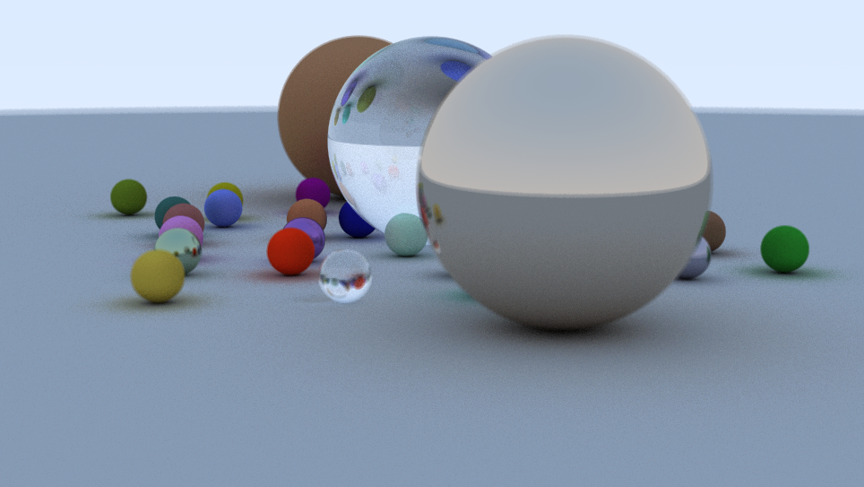

Done! Or sort of at least... I did not manage to fix that last problem I had with the reflection looking a bit off compared to the book, but I decided to go on with the rest anyway since the problem only shows up in the special case when the radius of a sphere is defined negatively (to get the look of a completely transparent glass ball). Anyway, here is the final result!

I couldn't generate the additional randomly placed spheres inside the shader, so I had to add some code in javascript that generates a string defining each sphere that I then append to the string literal with the shader code. I also added some basic interactivity to the ray tracer so the user can pan around and zoom in and out of the scene. Previosuly I rendered the image once but to get the interaction to work I had to rewrite the code a little so that's continously being re-rendered and update as the user interacts with it. By first rendering to a texture and then ping-pong between two textures as described in an earlier post I can let the image get smoother over time when it's kept still and when the user moves the camera the scene is "reset" and becomes a grainier before becoming smooth again.
