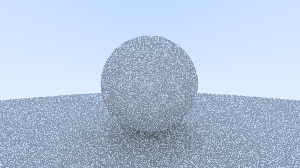

I've been working for the last two days on getting the rendering of diffuse materials to work, but I'm struggling with getting it to render properly. Right now I'm getting a lot of artefacts and I can't quite figure out why. 

I've been looking at others who have done something similar, but the only real difference I can find is that they all seem to render several passes to a texture that they then take the average of. I'm basically doing the same but in a for-loop inside the fragment shader and I'm not sure what the actual difference would be, but I can't seem to come up with any other way of proceeding right now.
