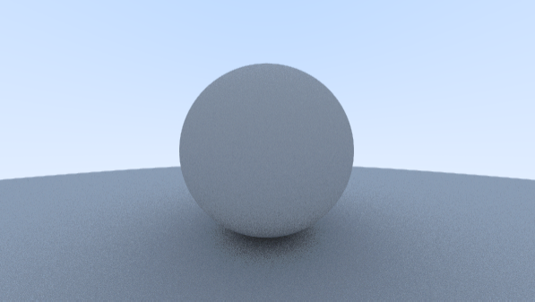

Finally, I managed to get the lambertian reflection to work! I found a working [glsl shader implementation](https://www.shadertoy.com/view/llVcDz) of the weekend ray tracer that I could compare my code to which helped me. First of, I replaced the functions I had for generating pseudo random numbers with the one from that code. Troubleshooting that code is not easy so using something I know works seemed like a better idea. I then compared their code with mine and two major issues, one was the way I was iterating over the ray hits.

In the Ray Tracing in one Weekend book it's done recursively but that's not possible in webGL and my implementation had some problem so I had to change it slightly. I was trying to sum the effects of each iteration on the color in one variable and then multiply the color by the final result, but now I instead just set the color to all white at the start and then multiply it by 0.5 each iteration where it hits something.

The second problem was that in the same function, but when I did not register a hit I set the color to be the color of the background (or the sky), but I should of course multiply the accumulated color with the color of the background.

Something else I've done is to move the antialiasing loop out of the shader code. Instead I draw the result to a texture that I can render to the canvas. I have another texture that I read from inside the shader and I switch between these textures so in one iteration I'm reading the previously rendered texture from one of them and drawing to the other, "ping-ponging" between the textures. On each iteration I add a little less of the new rendering and a little more of the old and since I'm always adding a little bit of randomness to the rays that are cast the image gets finer and finer. I got the idea from [this](https://madebyevan.com/webgl-path-tracing/).
