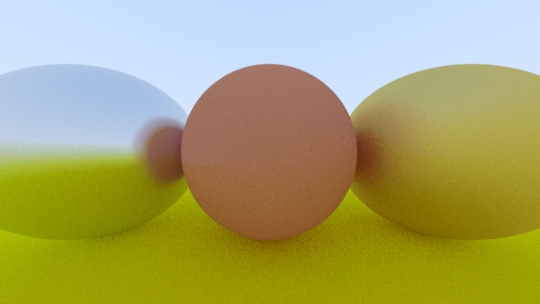
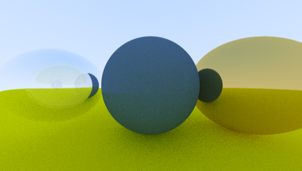

I've added other materials than the lambertian reflection model to the code. The first one is a metal material that reflects the light of it. It has a variable for controlling fuzziness, which basically means that incoming rays are reflected back with some randomness added to their direction.

The other material is a dielectric one, i.e. incoming light is both reflected and transmitted through the material. I'm not quite sure however if I've managed to get it to work properly. The reflection in the sphere looks different from the example image in the book, or it looks different when I add the Schlick approximation. The only difference that I can think of right now however is the function for generating random numbers, but it's possible that there is something else that I'm missing.

