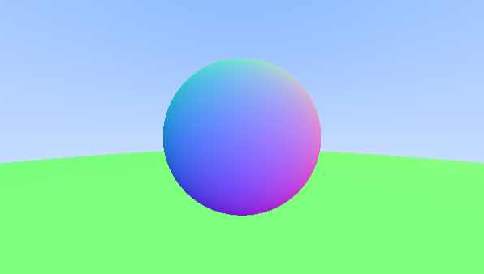

I added some basic support in the shader for more than one sphere. Took me a while to figure out that you have to add an "out" qualifier to function's input parameters that are to be changed, similar to pass-by-reference in c++.

