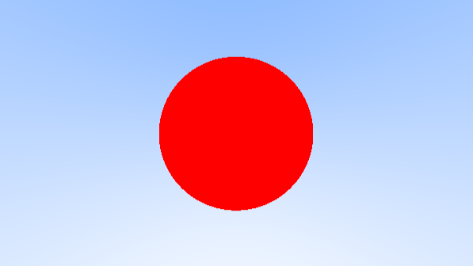
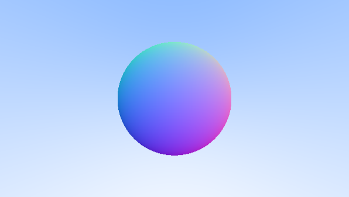

I've been trying for some time to get something to work that I saw in another implementation of a [ray tracer by Evan Wallace](https://madebyevan.com/webgl-path-tracing/). He renders the output from the fragment shader to a texture and then on the next render he switches to another texture which uses the results from the first to create a more detailed render. This means that the wuality gets better and better as time goes, unless you move the scene which means that the program has to recalculate the shaders and start rendering from scratch. I couldn't get this to work right now so I've started just implementing [Ray Tracing in One Weekend](https://raytracing.github.io/books/RayTracingInOneWeekend.html) code directly in the fragment shader and just render it to a rectangular surface.

I had to make some small changes to get things to work in WebGL, but transferring the code has been very straightforward so far. To calculate a ray going from the camera through each pixel I just run the fragment shader and use the gl_FragCoord variable to get the window relative x and y coordinates of each pixel (which I divide by the window width and height respectively). 

I've also made use of some of the inbuilt functions in glsl like mix() instead of writing my own linear interpolation function.

The next step will be to setup javascript classes for handling spheres and making the code a bit more general.
